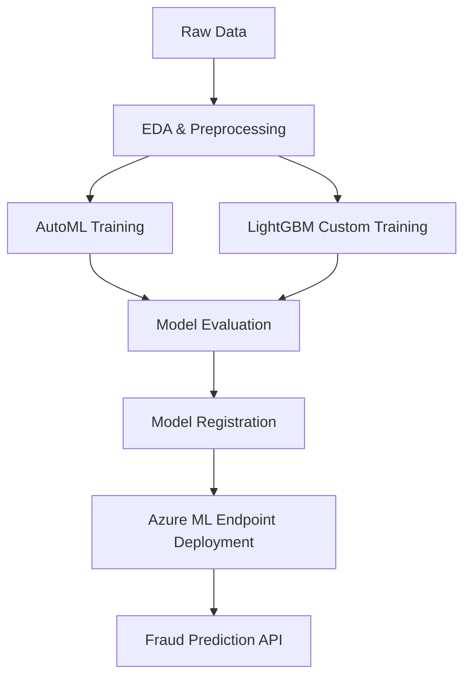

# 🚀 End-to-End Fraud Detection (Azure ML + AutoML + LightGBM)

  
  
  


A production-grade **end-to-end fraud detection system** using:

- **Azure Machine Learning (AML)**
- **AutoML for baseline model search**
- **LightGBM for custom, high-performance training**
- **MLOps-ready structure for enterprise workloads**

---

## 🧠 Project Architecture

### High-Level Pipeline (Conceptual)

```
                ┌─────────────────────┐
                │   Raw Transaction   │
                │        Data         │
                └──────────┬──────────┘
                           ▼
           ┌─────────────────────────────────┐
           │  Data Preprocessing & Cleaning  │
           │ (EDA, feature engineering, etc) │
           └──────────────────┬──────────────┘
                              ▼
             ┌──────────────────────────────────┐
             │     Training Pipeline (AML)      │
             │  - AutoML Classification         │
             │  - LightGBM Custom Training      │
             └──────────────────┬───────────────┘
                                ▼
                ┌────────────────────────────────┐
                │     Model Evaluation & Metrics │
                │ (AUC, Recall, Precision, F1)   │
                └──────────────────┬─────────────┘
                                   ▼
                     ┌────────────────────────┐
                     │   Model Registration   │
                     │  (Azure ML Registry)   │
                     └──────────┬─────────────┘
                                ▼
                ┌────────────────────────────────┐
                │   Deployment (Real-time API)   │
                │   - Azure Managed Endpoint     │
                │   - Docker/Conda environment   │
                └────────────────────────────────┘
```

### Mermaid Diagram



---

## 📂 Repository Structure

```
e2e-fraud-detection/
│
├── azure_connection/        
│   ├── ml_client_setup.py
│   └── config.json
│
├── data/                    
│   ├── raw/
│   └── register_data_to_azure/
│
├── exploratory_data_analysis/
│   └── eda_notebook.ipynb
│
├── train/
│   ├── auto_ml/
│   │   └── train_recall.py
│   ├── custom_train/
│   │   └── train_script.py
│   └── utils/
│
├── deploy/
│   ├── environment/
│   └── deploy_endpoint.py
│
└── README.md
```

---

## ✨ Key Features

### 🔹 Automated ML (AutoML)
- Automated model search  
- Smart hyperparameter tuning  
- Strong baseline model selection  
- Metrics optimized for fraud detection (Norm-Macro-Recall, AUC-Weighted)

### 🔹 Custom LightGBM Training
- Tuned for imbalanced classification  
- Fast gradient boosting  
- Feature importance outputs  
- Custom training loop

### 🔹 Azure Machine Learning (AML)
- Dataset registration  
- Compute cluster management  
- MLflow experiment tracking  
- Model versioning & registry  
- Managed endpoints for real-time inference

### 🔹 Production Inference API
- Lightweight scoring script  
- Conda/Docker environment  
- Real-time fraud prediction endpoint  

---

## 🛠 Installation

### 1. Clone the Repository

```bash
git clone https://github.com/CodeTemka/e2e-fraud-detection.git
cd e2e-fraud-detection
```

### 2. Create a Virtual Environment

```bash
python -m venv .venv
.venv\Scripts\activate      
# or
source .venv/bin/activate
```

### 3. Install Dependencies

```bash
pip install -r requirements.txt
```

### 4. Configure Azure ML

Update values in:

```
azure_connection/config.json
```

---

## 🧪 Training

### AutoML Training

```bash
python -m train.auto_ml.train_recall
```

### LightGBM Training

```bash
python train/custom_train/train_script.py
```

---

## 📈 Currently deployed model metrics

https://ml.azure.com/experiments/id/7fd82d29-73d4-418d-b094-61c33c36c153/runs/lightgbm-only-classification-job-f8330f03_29?wsid=%2Fsubscriptions%2Faa4acb09-3611-4169-8504-1e68ad04a40f%2FresourceGroups%2Fe2e-fraud-detection%2Fproviders%2FMicrosoft.MachineLearningServices%2Fworkspaces%2Fe2e-fraud-detection-ws&tid=2a4097cb-12db-4fa9-bc97-72c7c0027cae#metrics

---

## 🧾 Example Inference Request

```json
{
  "input_data": {
    "columns": ["Time","V1","V2","V3","V4","V5","V6","V7","V8","V9","V10","V11","V12","V13","V14","V15","V16","V17","V18","V19","V20","V21","V22","V23","V24","V25","V26","V27","V28","Amount"],
    "index": [0, 1],
    "data": [
            [2,-0.425965884412454,0.960523044882985,1.14110934232219,-0.168252079760302,0.42098688077219,-0.0297275516639742,0.476200948720027,0.260314333074874,-0.56867137571251,-0.371407196834471,1.34126198001957,0.359893837038039,-0.358090652573631,-0.137133700217612,0.517616806555742,0.401725895589603,-0.0581328233640131,0.0686531494425432,-0.0331937877876282,0.0849676720682049,-0.208253514656728,-0.559824796253248,-0.0263976679795373,-0.371426583174346,-0.232793816737034,0.105914779097957,0.253844224739337,0.0810802569229443,3.67],
            [406,-2.3122265423263,1.95199201064158,-1.60985073229769,3.9979055875468,-0.522187864667764,-1.42654531920595,-2.53738730624579,1.39165724829804,-2.77008927719433,-2.77227214465915,3.20203320709635,-2.89990738849473,-0.595221881324605,-4.28925378244217,0.389724120274487,-1.14074717980657,-2.83005567450437,-0.0168224681808257,0.416955705037907,0.126910559061474,0.517232370861764,-0.0350493686052974,-0.465211076182388,0.320198198514526,0.0445191674731724,0.177839798284401,0.261145002567677,-0.143275874698919,0]
        ]
  }
}
```

---

## 📌 Future Improvements

- CI/CD with GitHub Actions → Azure ML  
- Add SHAP explainability  
- Add drift monitoring  
- Unit tests  
- Data validation using Great Expectations  
- Batch inference pipeline  

---

## 📄 License

MIT License.

---

## 🙋 Contact

**Author:** Temuulen  
**GitHub:** https://github.com/CodeTemka  
