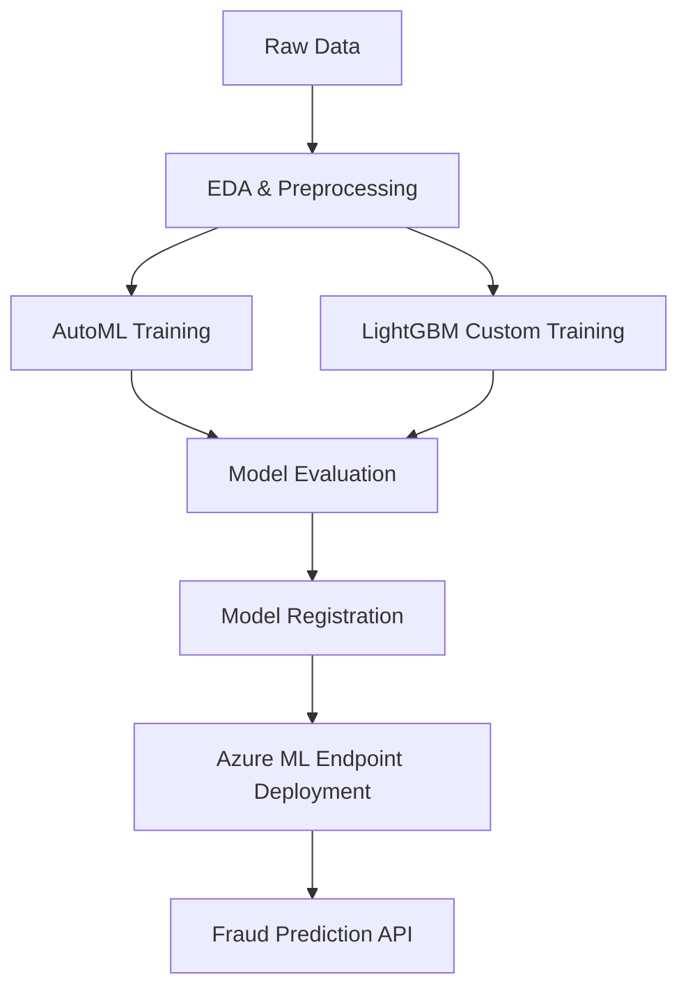

# 🚀 End-to-End Fraud Detection (Azure ML + AutoML + LightGBM)

  
  
  


A production-grade **end-to-end fraud detection system** using:

- **Azure Machine Learning (AML)**
- **AutoML for baseline model search**
- **LightGBM for custom, high-performance training**
- **MLOps-ready structure for enterprise workloads**

---

## 🧠 Project Architecture

### High-Level Pipeline (Conceptual)

```
                ┌─────────────────────┐
                │   Raw Transaction   │
                │        Data         │
                └──────────┬──────────┘
                           ▼
           ┌─────────────────────────────────┐
           │  Data Preprocessing & Cleaning  │
           │ (EDA, feature engineering, etc) │
           └──────────────────┬──────────────┘
                              ▼
             ┌──────────────────────────────────┐
             │     Training Pipeline (AML)      │
             │  - AutoML Classification         │
             │  - LightGBM Custom Training      │
             └──────────────────┬───────────────┘
                                ▼
                ┌────────────────────────────────┐
                │     Model Evaluation & Metrics │
                │ (AUC, Recall, Precision, F1)   │
                └──────────────────┬─────────────┘
                                   ▼
                     ┌────────────────────────┐
                     │   Model Registration   │
                     │  (Azure ML Registry)   │
                     └──────────┬─────────────┘
                                ▼
                ┌────────────────────────────────┐
                │   Deployment (Real-time API)   │
                │   - Azure Managed Endpoint     │
                │   - Docker/Conda environment   │
                └────────────────────────────────┘
```

### Mermaid Diagram



---

## 📂 Repository Structure

```
e2e-fraud-detection/
│
├── azure_connection/        
│   ├── ml_client_setup.py
│   └── config.json
│
├── data/                    
│   ├── raw/
│   └── processed/
│
├── exploratory_data_analysis/
│   └── eda_notebook.ipynb
│
├── train/
│   ├── auto_ml/
│   │   └── train_recall.py
│   ├── custom_train/
│   │   └── train_script.py
│   └── utils/
│
├── deploy/
│   ├── scoring/
│   │   └── score.py
│   ├── environment/
│   └── deploy_endpoint.py
│
└── README.md
```

---

## ✨ Key Features

### 🔹 Automated ML (AutoML)
- Automated model search  
- Smart hyperparameter tuning  
- Strong baseline model selection  
- Metrics optimized for fraud detection (Recall, AUC, F1)

### 🔹 Custom LightGBM Training
- Tuned for imbalanced classification  
- Fast gradient boosting  
- Feature importance outputs  
- Custom training loop

### 🔹 Azure Machine Learning (AML)
- Dataset registration  
- Compute cluster management  
- MLflow experiment tracking  
- Model versioning & registry  
- Managed endpoints for real-time inference

### 🔹 Production Inference API
- Lightweight scoring script  
- Conda/Docker environment  
- Real-time fraud prediction endpoint  

---

## 🛠 Installation

### 1. Clone the Repository

```bash
git clone https://github.com/CodeTemka/e2e-fraud-detection.git
cd e2e-fraud-detection
```

### 2. Create a Virtual Environment

```bash
python -m venv .venv
.venv\Scripts\activate      
# or
source .venv/bin/activate
```

### 3. Install Dependencies

```bash
pip install -r requirements.txt
```

### 4. Configure Azure ML

Update values in:

```
azure_connection/config.json
```

---

## 🧪 Training

### AutoML Training

```bash
python -m train.auto_ml.train_recall
```

### LightGBM Training

```bash
python train/custom_train/train_script.py
```

---

## 📈 Model Metrics (Example)

| Model | Recall | Precision | AUC | F1 |
|-------|--------|-----------|-----|-----|
| AutoML Best Model | 0.93 | 0.71 | 0.97 | 0.80 |
| LightGBM Custom | 0.95 | 0.69 | 0.98 | 0.79 |

---

## 🚀 Deployment

### Deploy to Azure Managed Endpoint

```bash
python deploy/deploy_endpoint.py
```

---

## 🧾 Example Inference Request

```json
POST /predict
{
  "features": {
      "amount": 100.0,
      "transaction_type": 2,
      "distance_from_home": 53.1,
      "distance_from_last_transaction": 1.2
  }
}
```

---

## 📌 Future Improvements

- CI/CD with GitHub Actions → Azure ML  
- Add SHAP explainability  
- Add drift monitoring  
- Unit tests  
- Data validation using Great Expectations  
- Batch inference pipeline  

---

## 📄 License

MIT License.

---

## 🙋 Contact

**Author:** Temuulen  
**GitHub:** https://github.com/CodeTemka  
