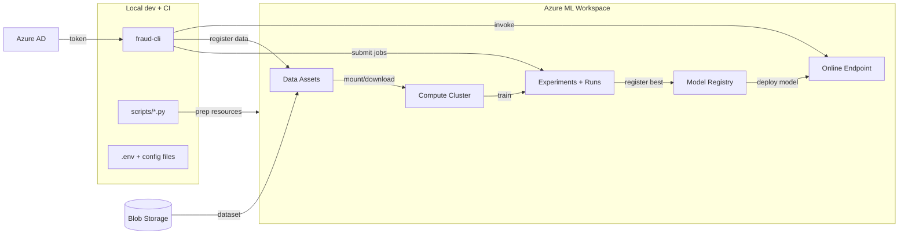

# Architecture

## System boundaries
The fraud-detection system consists of two major boundaries:

- **Local developer/CI boundary**: CLI, config files, and scripts that submit jobs and manage models.
- **Azure ML boundary**: managed compute, storage, experiment tracking, model registry, and online endpoints.

External dependencies include Azure Active Directory (auth), Azure Blob Storage (datasets), and
Azure ML-managed compute clusters.

## High-level flow
_Diagram format:_ Mermaid (replace with an image if preferred).

## Key components
- **CLI (`fraud-cli`)**: Submits AutoML and custom training jobs, registers best models, and manages
  endpoints. Source: `src/fraud_detection/cli/*`.
- **Training utilities**: AutoML and XGBoost training assets plus environment definitions.
  Source: `src/fraud_detection/training/*`.
- **Azure helpers**: Authentication, workspace access, MLflow registration.
  Source: `src/fraud_detection/azure/*`.

## Data & model lifecycle
1. Register raw datasets as Azure ML data assets.
2. Submit training jobs (AutoML or custom XGBoost sweep).
3. Register the best model in the Azure ML registry.
4. Promote the best model to production (if metrics improve).
5. Deploy to an online endpoint and invoke for scoring.
